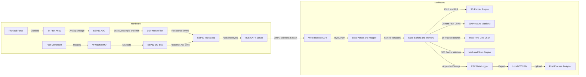

```mermaid
flowchart LR

subgraph Hardware
  direction TB
  F[Physical Force] -->|Crushes| FSR[8x FSR Array]
  M[Foot Movement] -->|Rotates| MPU[MPU6050 IMU]
  FSR -->|Analog Voltage| ADC[ESP32 ADC]
  MPU -->|I2C Data| I2C[ESP32 I2C Bus]
  ADC -->|16x Oversample and Trim| DSP[DSP Noise Filter]
  DSP -->|Resistance Ohms| MCU[ESP32 Main Loop]
  I2C -->|Pitch Roll Acc Gyro| MCU
  MCU -->|Pack into Bytes| BLE_TX[BLE GATT Server]
end

BLE_TX -->|100Hz Wireless Stream| BLE_RX[Web Bluetooth API]

subgraph Dashboard
  direction TB
  BLE_RX -->|Byte Array| Parser[Data Parser and Mapper]
  Parser -->|Parsed Variables| StateBuffer[State Buffers and Memory]
  StateBuffer -->|Pitch and Roll| ThreeJS[3D Render Engine]
  StateBuffer -->|Current FSR Ohms| MatrixUI[2D Pressure Matrix UI]
  StateBuffer -->|10 Packet Batches| PlotlyLive[Real Time Line Chart]
  StateBuffer -->|300 Packet Window| StatsEngine[Math and Stats Engine]
  StateBuffer -->|Appended Strings| CSV[CSV Data Logger]
  CSV -->|Export| Download[Local CSV File]
  Download -.->|Upload| Analyzer[Post Process Analyzer]
end
```
